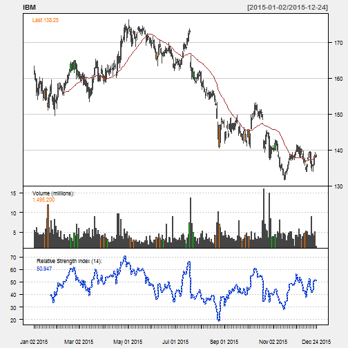
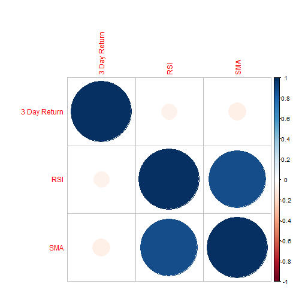

## Overview

Technical analysis is popular among stock investors.
We want to find out if they are really effective.
This project explored the following popular technical analysis indicators    
1. Relative Strength Index    
2. Simple Moving Average     
Their effectiveness is measured by correlating their values with future 3 day stock returns. 
I used 3 days to avoid randomness of daily returns. 

## Application Inputs
The inputs to the application include the following:    
1. Name of stock - A drop-down selection for user to choose either IBM, Apple or Microsoft    
2. Period for Relative Strength Indicator - A slider input with integer value from 2 to 20 with a default of 14    
3. Period for Simple Moving Average - A slider input with integer value from 10 to 50 with a default of 25    
Shiny App Link: https://architect15.shinyapps.io/stock_analysis

--- .class #id 

## The Stock Plot

The stock plot is for explorative data analysis purpose. It lets the user to visually see the stock price fluctuations together with the
technical analysis indicators.


```r
# plot the chart
chartSeries(IBM, theme="white", TA="addVo();addRSI(n=14);addSMA(n=25)") 
```

 

--- .class #id 

## The Correlation Plot
The correlation plot is to analyse the effectiveness of the technical analysis indicators using their correlation with 3 days of stock returns. I used 3 days of return to avoid the daily randomness of the stock movements. So if the indicators are of real predictive power, it should show the effect at least in 3 days. The values are then normalized in the following manner

1. 3 Day Return - The return is normalized as a percentage change in the future 3 days.   
2. Relative Strength Index - The RSI indicator is normalized by dividing it by 100 so that it falls between 1 and 0   
3. Simple Moving Average - The SMA is usually used to measure the deviation of stock price from the average of last n days. The SMA value is normalized to show the percentage deviation of stock closing price from the SMA value.   

A correlation matrix is then calculated and the correlation matrix is plotted using the 'corrplot' package. The color and size of the circles shows the extent of the correlations. 

--- .class #id

## The Correlation Plot

 
